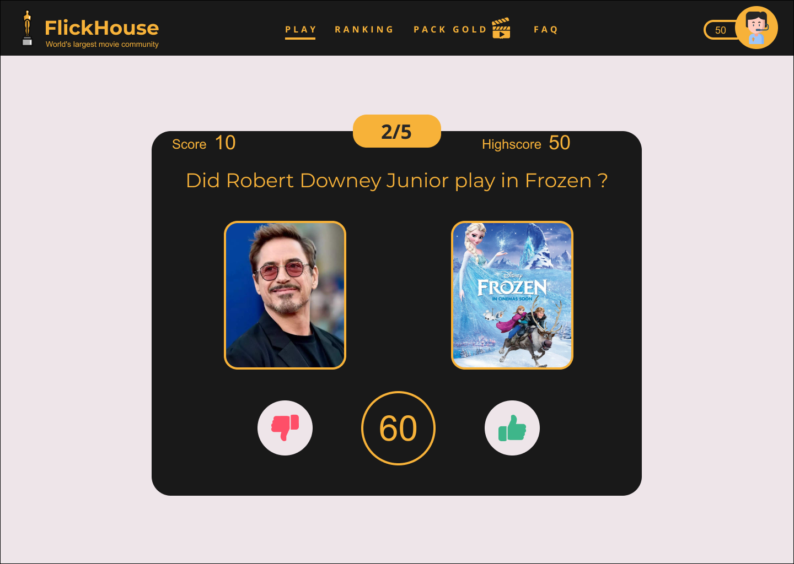

# [Flickhouse Application](https://junkiesan.github.io/react-flickHouse/)

FlickHouse is the world's future largest movie community quizz application.
This is FlickHouse's Proof of Concept, with it's core feature, quizzes.
Later on, this app will gather a whole community around quizzes and knowledge tests. The community will benefit from FlickHouse via discounts on theater tickets or on VOD systems. 
This application is coded in React because of it's huge community support, its component friendly concept and it's easyness to code mobile apps.
I used the following technologies:
* React
* Sass
* Webpack
* Babel
* Github Pages

## Researches

First, I listed the mandatory actions (user stories) that were asked to be realized for the test and list them in priority order: 
* As An app user I want to be greeted by a welcome screen upon arriving on the app so that I can read the rules and start playing when I'm ready
* As an app user I want a quizz to test my knowledge of actors in movies so that I can start playing and evaluate my knowledge
* As an app user I want to see the cover picture of the movie and the picture of the actor when being asked "Did XX star in" questions It can help me correctly answer the question
* As an app user I want the quizz to be limited in time so that I can try to improve my score over time
* As an app user I want my best score to be saved in-between attempts so that I can see it when retrying

Then, I listed the bonus actions and listed them in feasibility order:
* As an app user I want my best score to be saved in-between sessions
* As an app user I want to have a share button so that I can share my score to my friends
* As an app user I want to swipe on my phone so that I can play easily on smartphone


Then, I started to think about the product I needed to build. I know that quizz apps are quite trendy on social media so I chose to do some discovery on how challengers like QuizUp, Sporcle, Popcorn Trivia, Heads Up! had built theirs.

I defined the project and created a roadmap that I put on Github project [Github project ](https://github.com/junkiesan/react-flickHouse/projects/1).
Here you will find every tickets I realized and thought about. They are linked to issues, themselves linked to pull requests. Even though I worked alone, I tried to contribute to this project as if I was in a team. The quality of the tickets given on Notion was extremely helpfull and made really easier the thought processus for unit testing. 

### [Here is the link to the figma:](https://www.figma.com/file/JMZ1cJGna2bnkRBHvEVCWj/FlickHouse?node-id=0%3A1)
* a moodboard
* FlickHouse game page; When the user clicks on start, a game is launched for 60 seconds
* responsive design for mobile and tablet





## Initialization

First I had to create the project so I used the boilerplate from Le Wagon.

### Product

I took two days thinking about the product and how to build it. The core concept is the quizz but if you look further FlickHouse will have to host a whole community. That's why I looked up how this market challengers were organized.
* To keep a competitive aspect the application will have a ranking system with experience and medals. The whole community will have access to global or filtered ranking on the Ranking page
* Giving control to the user is a good way to keep him around, so there will be a feature to create personalized quizzes 
* Users will access their own dashboard and enjoy statistics on their product experience
* The FAQ page will be present to answer easily to most asked questions
* Freemium content will be available in exchange for a small contribution

### [The Movie Database](https://www.themoviedb.org/)

In order to create a cool quizz to pass I had the idea to look for the best data to fetch from the API.
Looking for popular movies and actors was a better idea than taking a random movie or a random actor.
That is why I chose the popular actor object in which a great key named "know_for" containing their most famous movies. 
I compiled those movies and asked if 20 or more popular actors were in those compiled movies.

## Testing

I chose Jest for testing purposes. I don't really know this tool but I know how to test in Ruby. That is why I only drafted tests corresponding to user stories. It will allow me to come back later to implement them.

## Production

The project is hosted on Github Pages, a product that I often use on other small apps.

## Scripts

After forking the project you can start the local Webpack Dev Server (usually on port `8080`):

```bash
yarn start
```

To lint all JavaScript files in the `src` folder:

```bash
yarn lint
```

To build and deploy your app to `gh-pages` branch on the GitHub repo:

```bash
yarn deploy
```

## Contributions

Pull requests are welcomed. For major changes, please open an issue first to discuss what you would like to change.

## Where I got stuck

* I struggled with states from Child to Parent components while doing the start button for the welcome component
* My npm package had some issues
* I lost some time managing my API key with the .env file
* It took me some time to fetch correctly the API with the componentDidMount()
* Handle the multiples request I gave to API
* Using Jest correctly
* How to change a props without calling it directly
* localStorage and how to use cookies
* Rendering in realtime the countdown that is only working in the backend
* Styling the app in React

## what I’d like to improve & learn

* Scrape more data from API and use GraphQL to handle it
* Create different categories of quizzes like old movies, animated ones, popular (the current one)
* Cover code with Jest
* Adding CI with Github Actions
* Style the navbar
* Add user good and bad answers on a modal at the end of the game
* Display counter ticking
* Create a Dashboard with statistic
* Add a share button [(I found this library to ease the implementation)](https://www.npmjs.com/package/react-share)
* Add a swipe animation [(I found this library to ease the implementation)](https://github.com/leandrowd/react-easy-swipe)